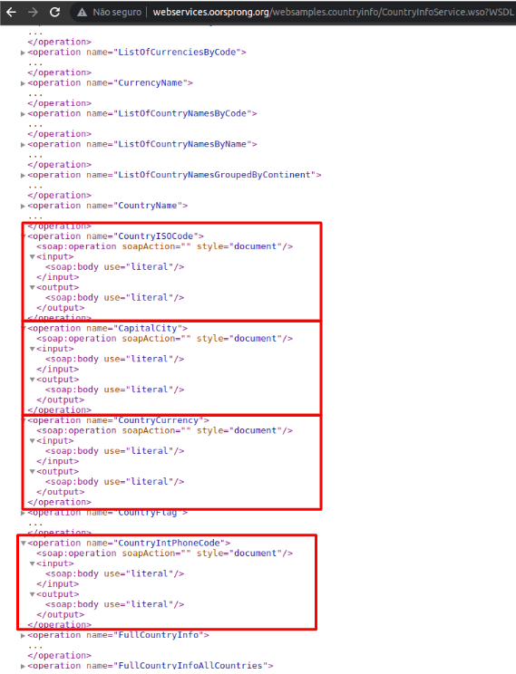
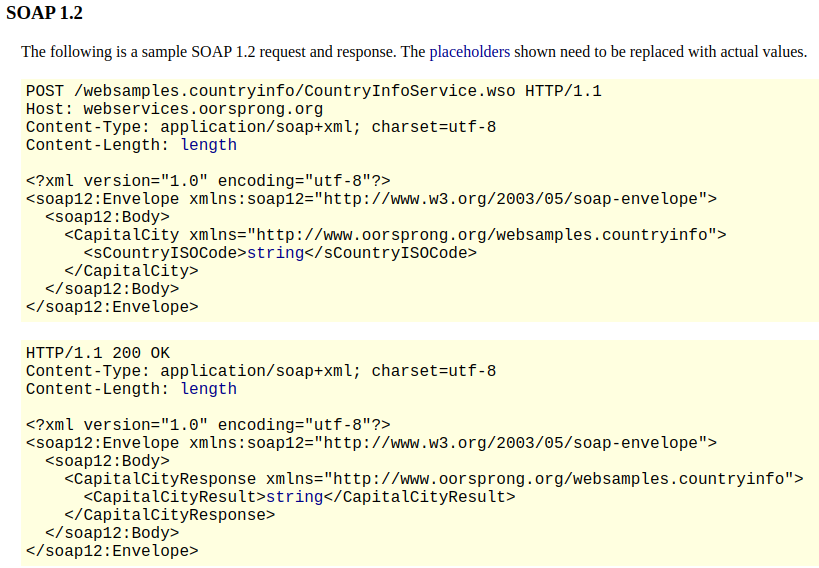

# Atividade 01 - APIs e Web Services

**Disciplina:** APIs e Web Services (AWS)

**Atividade:** 01 – Protocolo HTTP

**Link para acesso**: <https://github.com/ferreirawill/soap-client>

**Integrantes**:

* Jéssica Souza Pivoto
* William Carlos Moreira Ferreira

___

### Questões

**1) Crie uma aplicação simples, utilizando a linguagem/plataforma que você preferir, que consuma um Web Service SOAP. Implemente pelo menos três operações Web Service de exemplo: <https://www.crcind.com/csp/samples/SOAP.Demo.cls>**

Foi desenvolvida uma aplicação que consome informações do serviço: [DataFlex WebService for Country information](http://webservices.oorsprong.org/websamples.countryinfo/CountryInfoService.wso). Essa aplicação tem como objetivo apresentar informações de um determinado país para o usuário após ele digitar o nome, em inglês, deste no console. As informações que são apresentadas são:

* ISO Code do país
* A capital do país
* A moeda utilizada no país
* O DDI do país


O código fonte foi escrito em Python, utilizando a biblioteca [Zeep](https://docs.python-zeep.org/en/master/) para efetuar as requisições. As operações implementadas desse serviço foram:


| Objetivo | Operação |
| ------------- | ------------- |
| Buscar ISO Code do país  | CountryISOCode  |
| Buscar capital do país  | CapitalCity  |
| Buscar moeda utilizada no país  | CountryCurrency  |
| Buscar DDI do país  | CountryIntPhoneCode  |

Com a biblioteca Zeep instalada, é possível observar as operações que esse serviço implementa executando o seguinte comando no terminal:

```bash
python3 -mzeep http://webservices.oorsprong.org/websamples.countryinfo/CountryInfoService.wso?wsdl
```

Ao verificar o WSDL desta API foi possível observar que apesar de utilizar o SOAP, ela não opera dentro do padrão proposto, pois o parâmetro ***SOAPAction*** é sempre preenchido com uma string vazia para as operações realizadas. Como apresentado na imagem abaixo:


Dessa forma, a identificação da operação que está sendo solicitada do cliente para o servidor se dá pelo body da requisição. Essa informação pode ser confirmada na documentação da API onde o exemplo apresentado uma requisição e resposta de uma operação não possui o parâmetro ***SOAPAction*** no cabeçalho do HTTP, como mostrado na imagem abaixo:


Essa implementação diverge do [item 6.5.3 das recomendações do W3C](https://www.w3.org/TR/2007/REC-soap12-part2-20070427/#ActionFeature) onde é informado que essa propriedade não deve ser vazia.

Ainda assim, o código que executa as operações dessa API funciona corretamente enviando e recebendo as requisições e está disponível em: [SoapClient.py no GITHUB](https://github.com/ferreirawill/soap-client/blob/master/SoapClient.py)


**2) Instale um proxy HTTP na sua máquina e verifique as mensagens enviadas/recebidas quando a sua aplicação acessa algum dos recursos implementados no Web Service.**

O analisador de protocolo utilizado para capturar as requisições da aplicação foi o [Wireshark](https://www.wireshark.org/). Com a utilização do proxy, foi possível garantir a API não opera dentro do padrão proposto para utilização do SOAP pois o atributo ***SOAPAction*** é enviado vazio.

Os resultados das capturas efetuadas foram:

**1- Captura das requisiões após a execução do projeto:**


**2- Requisição e resposta da busca pelo ISO Code do país:**
* *Requisição:*

* *Resposta:*


**3- Requisição e resposta da busca pela Capital do país:**
* *Requisição:*

* *Resposta:*


**4- Requisição e resposta da busca pela Moeda do país:**
* *Requisição:*

* *Resposta:*


**2- Requisição e resposta da busca pela Capital do país:**
* *Requisição:*

* *Resposta:*
